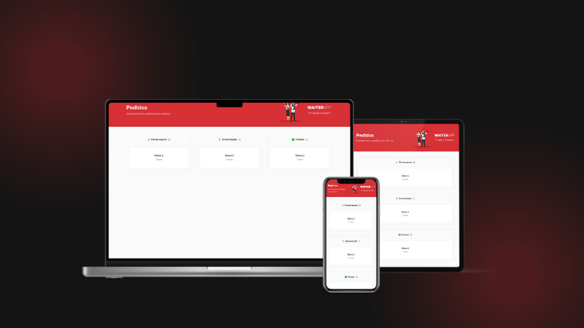

<p align="center">
  
</p>

<p align="center">
  

  

  
</p>

<h1 align="center">
    Waiter App Web
</h1>

<br>

## 🧪 Tecnologias

Este projeto foi desenvolvido utilizando as seguintes tecnologias:

- [Node.Js](https://nodejs.org/en)
- [Express.Js](https://expressjs.com/)
- [Multer](https://www.npmjs.com/package/multer)
- [TypeScript](https://www.typescriptlang.org/)
- [Mongoose](https://mongoosejs.com/)
- [Dotenv](https://www.npmjs.com/package/dotenv)

## 🚀 Executando projeto

Clone o projeto e acesse a pasta.

```bash
git clone https://github.com/Robson-Carvalho/waiter-app-api.git
cd waiter-app-web
```

Execute estes comandos para instalar as dependências e rodar o projeto.

```bash
npm install
```

```
npm run dev
```

## 📖 Descrição

O Waiter App Web é um projeto desenvolvido em React com TypeScript que tem como objetivo oferecer uma solução para gerenciamento de pedidos e mesas em restaurantes. O aplicativo é construído com tecnologias modernas e é escalável para atender as necessidades de diferentes tipos de restaurantes.

## 📝 License

Este projeto está licenciado sob a licença MIT. Veja o arquivo [LICENSE](./LICENSE) para mais detalhes.

---

Feito com 💜 por [Robson Carvalho](https://portfolio-robson-carvalho.vercel.app/) 👋
